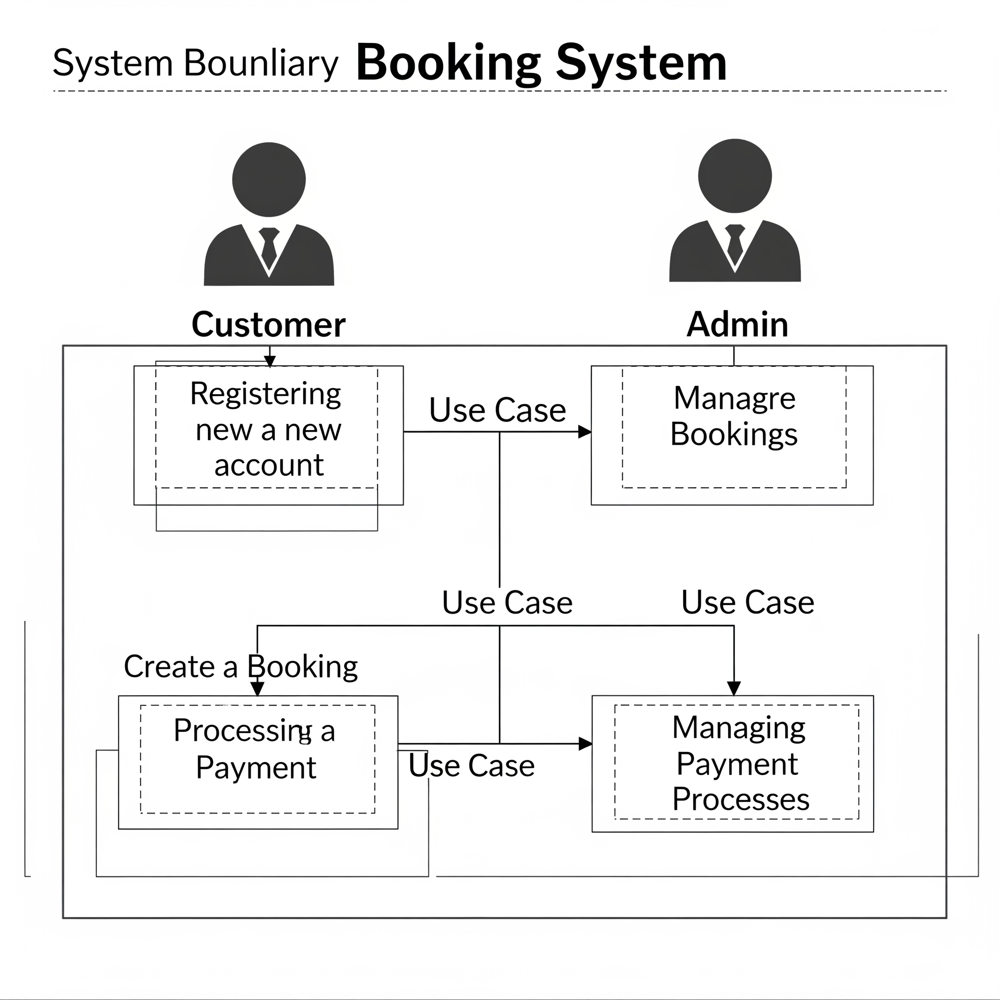

# Requirement Analysis in Software Development

## Introduction  
This repository is dedicated to exploring **requirement analysis** in software development. It serves as a resource for best practices, templates, tools, and case studies related to gathering, documenting, and validating software requirements. Whether you're a business analyst, developer, or project manager, this repository aims to provide useful insights into effective requirement analysis techniques.

---

## What is Requirement Analysis?  
**Requirement Analysis** is the process of identifying, documenting, and validating the needs and constraints of stakeholders to define the functional and non-functional requirements of a software system. It bridges the gap between business objectives and technical implementation, ensuring the final product aligns with user expectations.

### Key Activities  
1. **Elicitation**: Gathering requirements through interviews, surveys, workshops, or user stories.  
2. **Documentation**: Creating clear specifications (e.g., **SRS** or user stories).  
3. **Validation**: Checking for completeness, consistency, and feasibility.  
4. **Prioritization**: Ranking requirements based on business value and technical constraints.  

### Importance in SDLC  
✔ **Reduces risks** by catching ambiguities early  
✔ **Guides design/development** with a clear blueprint  
✔ **Aligns stakeholders** (clients, teams, users)  
✔ **Enables accurate testing** with well-defined criteria  

> Without proper analysis, projects risk scope creep, delays, or product failures.

---

## Why is Requirement Analysis Important?  
Requirement Analysis is the foundation of successful software development. Here’s why it’s critical:  

### 1. Prevents Costly Errors  
- Identifying and fixing ambiguities or gaps **early in the SDLC** is far cheaper than reworking code post-development.  
- Example: A missed regulatory requirement discovered late could force a complete redesign.  

### 2. Ensures Stakeholder Alignment  
- Clarifies expectations between **clients, developers, and end-users**, reducing conflicts later.  
- Tools like **use case diagrams** or **user stories** visualize needs for all parties.  

### 3. Drives Efficient Development  
- Clear requirements act as a **roadmap**, preventing scope creep and unnecessary features.  
- Enables accurate **effort estimation** and resource allocation.  

> Studies show that **~60% of project failures** stem from poor requirement analysis ([Source: PMI](https://www.pmi.org)).

## Key Activities in Requirement Analysis

The requirement analysis process involves five core activities to ensure comprehensive and actionable specifications:

### 1. Requirement Gathering
- **Objective**: Collect raw input from stakeholders (clients, users, domain experts).  
- **Methods**:  
  - Stakeholder interviews  
  - Surveys/questionnaires  
  - Market research  
- **Output**: Initial list of needs and expectations.  

### 2. Requirement Elicitation  
- **Objective**: Extract implicit or unstated needs through structured techniques.  
- **Methods**:  
  - Workshops (e.g., JAD sessions)  
  - User story mapping (Agile)  
  - Observation/ethnographic studies  
- **Output**: Refined, detailed requirements.  

### 3. Requirement Documentation  
- **Objective**: Formalize requirements into clear, shareable artifacts.  
- **Artifacts**:  
  - Software Requirements Specification (SRS)  
  - Use cases or user stories  
  - Wireframes/prototypes  
- **Key Rule**: Use **unambiguous language** (avoid "should" or "may").  

### 4. Requirement Analysis and Modeling  
- **Objective**: Organize and visualize requirements for technical feasibility.  
- **Techniques**:  
  - Data flow diagrams (DFD)  
  - Entity-Relationship diagrams (ERD)  
  - UML diagrams (e.g., activity diagrams)  
- **Outcome**: Structured requirements ready for design.  

### 5. Requirement Validation  
- **Objective**: Ensure requirements are correct, complete, and testable.  
- **Approaches**:  
  - Peer reviews/inspections  
  - Prototype testing  
  - Traceability matrices (mapping to business goals)  
- **Success Metric**: Stakeholder sign-off.  

# Types of Requirements

## Functional Requirements
Functional requirements define the specific behaviors or functions that the booking management system must perform. These are actions the system should take to meet user and business needs.

**Examples for a Booking Management Project:**
1. **User Registration & Authentication**: The system shall allow users to register and log in using email and password.
2. **Booking Creation**: The system shall enable users to create new bookings by selecting dates, times, and services.
3. **Availability Check**: The system shall display real-time availability of resources (e.g., rooms, tables, slots) before confirming a booking.
4. **Payment Processing**: The system shall integrate with a payment gateway to process credit/debit card transactions.
5. **Booking Modification**: The system shall allow users to modify or cancel bookings up to 24 hours before the scheduled time.
6. **Notification System**: The system shall send email/SMS confirmations upon booking creation/modification/cancellation.

## Non-functional Requirements
Non-functional requirements describe how the system should perform its functions, focusing on quality attributes rather than specific behaviors.

**Examples for a Booking Management Project:**
1. **Performance**: The system shall load booking availability results within 2 seconds for 95% of requests.
2. **Scalability**: The system shall handle 10,000 concurrent users during peak hours.
3. **Security**: All user data and payment transactions shall be encrypted using TLS 1.2 or higher.
4. **Reliability**: The system shall maintain 99.9% uptime excluding scheduled maintenance.
5. **Usability**: The booking interface shall be navigable by first-time users with less than 2 minutes of training.
6. **Compliance**: The system shall adhere to GDPR regulations for data storage and processing.
7. **Backup & Recovery**: The system shall perform daily backups and restore data within 1 hour in case of failure.

## Use Case Diagrams

### Definition
A **Use Case Diagram** is a visual representation of interactions between **actors** (users or external systems) and the **system** to achieve specific goals. It captures functional requirements in a user-centric way.

### Benefits
1. **Clarifies System Scope**: Identifies key functionalities and boundaries.  
2. **User-Focused**: Aligns development with user needs.  
3. **Simplifies Communication**: Bridges gaps between stakeholders and developers.  
4. **Guides Testing**: Helps derive test scenarios.  

### Booking System Use Case Diagram
  

#### **Actors**:
- **Guest**: Unregistered user (can browse and register).  
- **Customer**: Registered user (can book/modify/cancel).  
- **Admin**: Manages bookings, users, and system settings.  
- **Payment Gateway**: External service for processing payments.  

#### **Key Use Cases**:
1. `Register Account` (Guest → Customer)  
2. `Search Availability`  
3. `Create Booking`  
4. `Process Payment` (interacts with Payment Gateway)  
5. `Cancel Booking`  
6. `Generate Reports` (Admin)  

> **Note**: The diagram was created using [Draw.io](https://app.diagrams.net/) and exported as `alx-booking-uc.png`.  